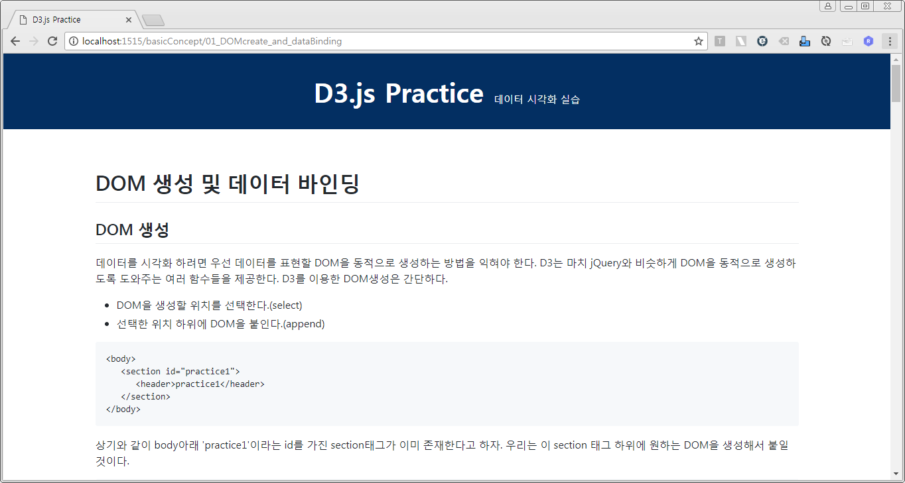

node.js 서버로 구동되는 웹서비스에서 D3.js 실습 예제들을 제공

## 프로젝트 구성
- node.js
- express.js
- grunt
- pug
- d3.js

## 구동방법
- repository clone
- [node.js](https://nodejs.org/ko/) 다운로드
- project 최상단 폴더(../../D3js-practice/) 에서 아래 명령어 수행
   - npm install
   - grunt
   - node server.js
- 브라우저에서 http://localhost:1515/ 접속

	
	 
	<b>구동된 화면</b>

## 참고서적
- D3.js (Scott Murray 지음/변치훈 옮김)

## 참고 URL
- 'Pug' template engine Docs
https://pugjs.org/api/getting-started.html
- 'Pug' template engine 문법 가이드
https://codeburst.io/getting-started-with-pug-template-engine-e49cfa291e33
- node js 웹서비스 만들기
https://opentutorials.org/course/2136